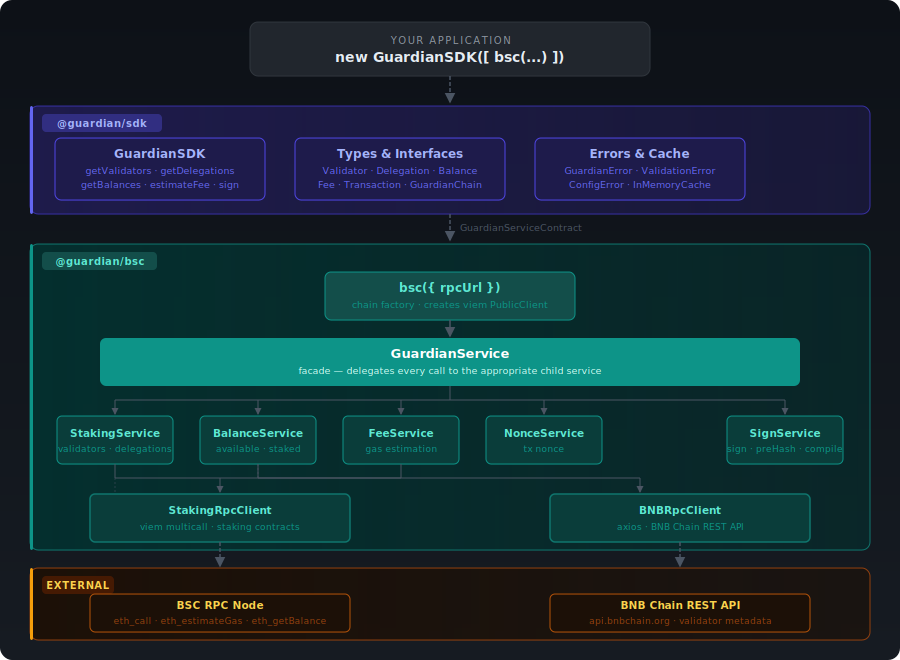
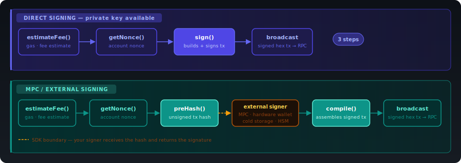

<p align="center">
  
</p>

<p align="center">
  <a href="https://github.com/JaimeToca/bnb-native-staking/actions/workflows/ci.yml">
    
  </a>
  <a href="https://www.npmjs.com/package/@guardian/bsc">
    
  </a>
  <a href="https://www.npmjs.com/package/@guardian/sdk">
    
  </a>
  <a href="https://www.npmjs.com/package/@guardian/bsc">
    
  </a>
  <a href="./LICENSE">
    
  </a>
  <a href="https://github.com/JaimeToca/bnb-native-staking/blob/main/CONTRIBUTING.md">
    
  </a>
  
  
</p>

The **Guardian SDK** is a modular, chain-agnostic staking SDK for TypeScript. It is structured as a multi-package monorepo: a chain-agnostic core (`@guardian/sdk`) and one package per supported chain. Install only the chain you need.

```typescript
import { GuardianSDK } from "@guardian/sdk";
import { bsc, BSC_CHAIN, TransactionType, PrivateKey, Curve } from "@guardian/bsc";
import { parseEther } from "viem";

const sdk = new GuardianSDK([bsc({ rpcUrl: "https://bsc-dataseed.bnbchain.org" })]);

const validators = await sdk.getValidators(BSC_CHAIN);
const fee = await sdk.estimateFee({
  type: TransactionType.Delegate,
  chain: BSC_CHAIN,
  amount: parseEther("1"),
  account: "0xYourAddress",
  isMaxAmount: false,
  validator: validators[0],
});
const nonce = await sdk.getNonce(BSC_CHAIN, "0xYourAddress");
const rawTx = await sdk.sign({
  transaction: { type: TransactionType.Delegate, chain: BSC_CHAIN, amount: parseEther("1"), isMaxAmount: false, validator: validators[0] },
  fee,
  nonce,
  privateKey: PrivateKey.from("0xYourPrivateKey", Curve.Secp256k1),
});
const txHash = await sdk.broadcast(BSC_CHAIN, rawTx);
```

## Why Guardian SDK

Most SDKs today expose **low-level primitives**, but stop short of solving the real developer problem.

They typically:
- Return raw data without meaningful state interpretation  
- Don’t track **delegation lifecycle status** 
- Require developers to understand **protocol-specific staking mechanics** (unbonding periods, validator states, reward flows)  
- Force teams to reimplement the same logic across chains  

As a result, developers are still burdened with deep staking knowledge, even when using an SDK. **Guardian SDK aims to abstract staking mechanics through a unified, generic API.**

Beyond the code itself, the Guardian SDK is designed to serve as both a reference implementation and a knowledge resource for staking across the blockchain ecosystem. Exploring the SDK—especially the READMEs for each supported chain—delivers deeper, more practical insight than traditional documentation, offering real-world examples of how staking is implemented in practice.

## Table of Contents

- [Packages](#packages)
- [Architecture](#architecture)
- [How it works](#how-it-works)
- [Staking API](#staking-api)
  - [getValidators](#getvalidatorschain)
  - [getDelegations](#getdelegationschain-address)
  - [getBalances](#getbalanceschain-address)
  - [getNonce](#getnoncechain-address)
  - [estimateFee](#estimatefeetransaction)
  - [sign](#signsigningargs)
  - [preHash / compile](#prehashhargs--compileargs)
  - [broadcast](#broadcastchain-rawtx)
- [Sample — Delegate on BNB Smart Chain](#sample--delegate-on-bnb-smart-chain)
- [Signing Flows](#signing-flows)
- [Logging](#logging)
- [Testing](#testing)
- [Error Handling](#error-handling)
  - [ValidationError](#validationerror)
  - [ConfigError](#configerror)
  - [SigningError](#signingerror)
- [Roadmap](#roadmap)
- [Contributing](#contributing)

---

## Packages

| Package | Chain | Status | Docs |
|---|---|---|---|
| [`@guardian/bsc`](./packages/bsc/README.md) | BNB Smart Chain | Available | [README](./packages/bsc/README.md) |
| `@guardian/sui` | SUI | In Progress | — |
| `@guardian/tron` | Tron | Planned | — |
| `@guardian/solana` | Solana | Planned | — |
| `@guardian/aptos` | Aptos | Planned | — |
| `@guardian/cardano` | Cardano | Planned | — |

Each chain ships as an independent package — install only what you need, your bundle never pays for chains you don't use. `@guardian/sdk` is included automatically as a dependency of each chain package.

---

## Architecture

> The diagram above shows how `@guardian/bsc` plugs into the SDK. Each chain package implements `GuardianServiceContract` independently — it can expose any number of services and RPC clients suited to that chain's protocol. `GuardianSDK` only ever sees the contract interface and routes calls by `chain.id`.



---

## How it works

Install the chain package you need, then pass its factory to `GuardianSDK`:

```typescript
import { GuardianSDK } from "@guardian/sdk";
import { bsc, BSC_CHAIN } from "@guardian/bsc";

const sdk = new GuardianSDK([
  bsc({ rpcUrl: "https://bsc-dataseed.bnbchain.org" }),
]);
```

Adding another chain later is just adding another entry to the array:

```typescript
import { GuardianSDK } from "@guardian/sdk";
import { bsc, BSC_CHAIN } from "@guardian/bsc";
import { tron, TRON_CHAIN } from "@guardian/tron"; // when available

const sdk = new GuardianSDK([
  bsc({ rpcUrl: "https://bsc-dataseed.bnbchain.org" }),
  tron({ rpcUrl: "https://api.trongrid.io" }),
]);
```

No chain IDs to configure manually, no internal wiring — install the package, pass the factory, done.

---

## Staking API

The same API surface is available on every supported chain. Pass the chain object as the first argument to scope each call.

| Method | Returns | Description |
|--------|---------|-------------|
| [`getValidators(chain)`](#getvalidatorschain) | `Validator[]` | All validators — active, inactive, and jailed |
| [`getDelegations(chain, address)`](#getdelegationschain-address) | `Delegations` | All delegations for an address plus a protocol-level summary if available |
| [`getBalances(chain, address)`](#getbalanceschain-address) | `Balance[]` | Available, staked, pending, and claimable balances |
| [`getNonce(chain, address)`](#getnoncechain-address) | `number` | Current transaction nonce, required before signing |
| [`estimateFee(transaction)`](#estimatefeetransaction) | `Fee` | Fee calculation for staking transaction types |
| [`sign(signingArgs)`](#signsigningargs) | `string` | Sign a transaction directly with a private key |
| [`preHash(args)`](#prehashhargs--compileargs) | `PrehashResult` | Serialize an unsigned transaction for external/MPC signing |
| [`compile(args)`](#prehashhargs--compileargs) | `string` | Reassemble a signed transaction |
| [`broadcast(chain, rawTx)`](#broadcastchain-rawtx) | `string` | Broadcast a signed raw transaction and return the tx hash |

> **Note:** Some APIs — such as `getValidators` — may be extended in future releases (e.g. pagination support). The SDK initialization may also be extended to allow injecting additional configuration options per chain.

---

### `getValidators(chain)`

Returns all validators on the network — active, inactive, and jailed.

**Returns:** `Promise<Validator[]>`

```typescript
interface Validator {
  id: string;
  name: string;
  description: string;
  image: string | undefined;
  status: ValidatorStatus;      // Active | Inactive | Jailed
  apy: number;                  // Annual percentage yield (%)
  delegators: number;
  operatorAddress: string;
  creditAddress: string;
}
```

```typescript
const validators = await sdk.getValidators(BSC_CHAIN);
// validators[0] → { name, apy, status, operatorAddress, ... }
```

---

### `getDelegations(chain, address)`

Returns all delegations for an address and a protocol-level staking summary.

**Returns:** `Promise<Delegations>`

```typescript
interface Delegations {
  delegations: Delegation[];
  stakingSummary: StakingSummary;
}

interface Delegation {
  id: string;
  validator: Validator;
  amount: bigint;               // Current value in wei
  status: DelegationStatus;    // Active | Pending | Claimable | Inactive
  delegationIndex: bigint;     // Required for Claim transactions
  pendingUntil: number;        // Unix timestamp (ms) when unbonding completes
}

interface StakingSummary {
  totalProtocolStake: number;
  maxApy: number;
  minAmountToStake: bigint;      // In wei
  unboundPeriodInMillis: number;
  redelegateFeeRate: number;
  activeValidators: number;
  totalValidators: number;
}
```

```typescript
const { delegations, stakingSummary } = await sdk.getDelegations(BSC_CHAIN, "0xYourAddress");

console.log(stakingSummary.maxApy);           // best APY across all validators
console.log(stakingSummary.minAmountToStake); // minimum stake in wei

for (const d of delegations) {
  console.log(d.validator.name, d.amount, d.status);
}
```

---

### `getBalances(chain, address)`

Returns the four balance categories for an address.

**Returns:** `Promise<Balance[]>`

```typescript
interface Balance {
  type: BalanceType;
  amount: bigint;   // In wei
}

enum BalanceType {
  Available = "Available",  // Wallet balance, immediately spendable
  Staked    = "Staked",     // Delegated and earning rewards
  Pending   = "Pending",    // In the unbonding window
  Claimable = "Claimable",  // Unbonding complete, ready to withdraw
}
```

```typescript
import { formatEther } from "viem";

const balances = await sdk.getBalances(BSC_CHAIN, "0xYourAddress");

for (const balance of balances) {
  console.log(balance.type, formatEther(balance.amount));
}
// Available  1.5
// Staked     10.0
// Pending    2.0
// Claimable  0.5
```

---

### `getNonce(chain, address)`

Returns the current transaction nonce for an address. Required before calling `sign` or `preHash`.

**Returns:** `Promise<number>`

```typescript
const nonce = await sdk.getNonce(BSC_CHAIN, "0xYourAddress");
```

---

### `estimateFee(transaction)`

Simulates a transaction on-chain and returns the estimated gas fee.

**Returns:** `Promise<Fee>`

```typescript
interface GasFee {
  type: FeeType.GasFee;
  gasPrice: bigint;   // In wei
  gasLimit: bigint;
  total: bigint;      // gasPrice × gasLimit, in wei
}
```

```typescript
import { TransactionType } from "@guardian/bsc";
import { parseEther } from "viem";

const fee = await sdk.estimateFee({
  type: TransactionType.Delegate,
  chain: BSC_CHAIN,
  amount: parseEther("1"),
  account: "0xYourAddress",
  isMaxAmount: false,
  validator: validators[0],
});

console.log(fee.gasPrice, fee.gasLimit, fee.total);
```

Transaction types: `Delegate`, `Undelegate`, `Redelegate`, `Claim`. See the [BSC README](./packages/bsc/README.md#estimatefee) for the full shape of each.

---

### `sign(signingArgs)`

Signs a transaction and returns the raw hex string ready to broadcast.

**Returns:** `Promise<string>`

```typescript
import { PrivateKey, Curve } from "@guardian/bsc";

const rawTx = await sdk.sign({
  transaction: {
    type: TransactionType.Delegate,
    chain: BSC_CHAIN,
    amount: parseEther("1"),
    isMaxAmount: false,
    validator: validators[0],
  },
  fee,
  nonce,
  privateKey: PrivateKey.from("0xYourPrivateKey", Curve.Secp256k1),
});
```

---

### `preHash(args)` / `compile(args)`

For MPC wallets, hardware wallets, or any setup where the private key is not directly available.

**`preHash` returns:** `Promise<PrehashResult>`

```typescript
interface PrehashResult {
  serializedTransaction: string;  // Chain-encoded transaction to send to the external signer
  signArgs: BaseSignArgs;         // Passed through to compile()
}
```

**`compile` returns:** `Promise<string>` — the final signed raw transaction.

`compile` accepts a `signature` field — a raw signature string produced by your external signer. The format is chain-specific (e.g. hex for BSC, base64 for Solana). Each chain package handles the decoding internally.

```typescript
// Step 1 — serialize
const { serializedTransaction, signArgs } = await sdk.preHash({
  transaction: { type: TransactionType.Delegate, chain: BSC_CHAIN, ... },
  fee,
  nonce,
});

// Send serializedTransaction to your external signer → get back a raw hex signature

// Step 2 — assemble
const rawTx = await sdk.compile({ signArgs, signature: "0x<hex-signature>" });
```

---

### `broadcast(chain, rawTx)`

Broadcasts a signed raw transaction to the network and returns the transaction hash.

**Returns:** `Promise<string>`

```typescript
const txHash = await sdk.broadcast(BSC_CHAIN, rawTx);
console.log(`Transaction hash: ${txHash}`);
```

`rawTx` is the string returned by either `sign()` or `compile()`.

---

## Sample — Delegate on BNB Smart Chain

End-to-end example using direct signing:

```typescript
import { GuardianSDK } from "@guardian/sdk";
import { bsc, BSC_CHAIN, TransactionType, PrivateKey, Curve } from "@guardian/bsc";
import { parseEther, formatEther } from "viem";

const sdk = new GuardianSDK([
  bsc({ rpcUrl: "https://bsc-dataseed.bnbchain.org" }),
]);

const ADDRESS = "0xYourAddress";
const PRIVATE_KEY = PrivateKey.from("0xYourPrivateKey", Curve.Secp256k1);

// 1. Pick a validator
const validators = await sdk.getValidators(BSC_CHAIN);
const validator = validators.find((v) => v.name === "Binance Staking") ?? validators[0];
console.log(`Staking with ${validator.name} — APY: ${validator.apy}%`);

// 2. Check available balance
const balances = await sdk.getBalances(BSC_CHAIN, ADDRESS);
const available = balances.find((b) => b.type === "Available")!;
console.log(`Available: ${formatEther(available.amount)} BNB`);

// 3. Estimate fee
const amount = parseEther("1");
const fee = await sdk.estimateFee({
  type: TransactionType.Delegate,
  chain: BSC_CHAIN,
  amount,
  account: ADDRESS,
  isMaxAmount: false,
  validator,
});
console.log(`Estimated fee: ${formatEther(fee.total)} BNB`);

// 4. Sign
const nonce = await sdk.getNonce(BSC_CHAIN, ADDRESS);
const rawTx = await sdk.sign({
  transaction: {
    type: TransactionType.Delegate,
    chain: BSC_CHAIN,
    amount,
    isMaxAmount: false,
    validator,
  },
  fee,
  nonce,
  privateKey: PRIVATE_KEY,
});

// 5. Broadcast
const txHash = await sdk.broadcast(BSC_CHAIN, rawTx);
console.log(`Transaction hash: ${txHash}`);
```

For chain-specific details (protocol parameters, transaction shapes, error codes) see:

- [BNB Smart Chain →](./packages/bsc/README.md)

---

## Signing Flows



The MPC flow is designed for setups where the private key is managed externally — hardware wallets, MPC servers, or custodians. `preHash()` serializes the transaction and returns it ready to sign. `compile()` assembles the final signed transaction from a raw hex signature string — chain-agnostic by design, each chain package handles the internal decoding.

---

## Logging

The SDK is **silent by default** — no logs are emitted unless you opt in. Pass a logger to the chain factory to enable it.

### Built-in console logger

```typescript
import { ConsoleLogger } from "@guardian/sdk";
import { bsc } from "@guardian/bsc";

const sdk = new GuardianSDK([
  bsc({
    rpcUrl: "https://bsc-dataseed.bnbchain.org",
    logger: new ConsoleLogger("debug"), // "debug" | "info" | "warn" | "error"
  }),
]);
```

Sample output:

```
[2026-03-27T19:00:37.123Z] [guardian] [DEBUG] StakingService: validators cache miss — fetching from RPC
[2026-03-27T19:00:37.124Z] [guardian] [DEBUG] BNBRpcClient: fetching validators { "url": "https://api.bnbchain.org/..." }
[2026-03-27T19:00:37.891Z] [guardian] [DEBUG] BNBRpcClient: validators fetched { "count": 45, "ms": 767 }
[2026-03-27T19:00:38.103Z] [guardian] [INFO]  SignService: signing transaction { "type": "delegate", "chain": "bsc-mainnet" }
[2026-03-27T19:00:38.201Z] [guardian] [INFO]  SignService: transaction signed
```

### Bring your own logger

Implement the `Logger` interface from `@guardian/sdk` to plug in any logging library:

```typescript
import type { Logger } from "@guardian/sdk";
import winston from "winston";

const winstonLogger = winston.createLogger({ ... });

// Adapt your logger to the Logger interface
const logger: Logger = {
  debug: (msg, ctx) => winstonLogger.debug(msg, ctx),
  info:  (msg, ctx) => winstonLogger.info(msg, ctx),
  warn:  (msg, ctx) => winstonLogger.warn(msg, ctx),
  error: (msg, ctx) => winstonLogger.error(msg, ctx),
};

const sdk = new GuardianSDK([
  bsc({ rpcUrl: "...", logger }),
]);
```

### Log levels

| Level | What is logged |
|-------|---------------|
| `debug` | RPC calls, response times, multicall batch sizes, cache hits/misses, fee details |
| `info` | Sign, preHash, and compile lifecycle events |
| `warn` | Retries, unexpected empty responses |

> **Note:** The SDK does **not** log errors that are thrown — those are left entirely to the caller to avoid duplicate log entries. Private keys and signatures are **never** logged at any level.

---

## Testing

`@guardian/sdk` ships test utilities so you can unit-test your own code without hitting real RPC nodes.

### `createMockService(overrides?, chain?)`

Returns a fully-typed `GuardianServiceContract` with no-op defaults. Pass only the methods relevant to your test.

```typescript
import { describe, it, expect, vi } from "vitest";
import { GuardianSDK } from "@guardian/sdk";
import { createMockService, mockValidator } from "@guardian/sdk/testing";
import { BSC_CHAIN } from "@guardian/bsc";

describe("my staking feature", () => {
  it("renders the validator with the highest APY", async () => {
    const sdk = new GuardianSDK([
      createMockService({
        getValidators: vi.fn().mockResolvedValue([
          mockValidator({ name: "Alpha", apy: 8 }),
          mockValidator({ name: "Beta",  apy: 12 }),
        ]),
      }),
    ]);

    const validators = await sdk.getValidators(BSC_CHAIN);
    const best = validators.sort((a, b) => b.apy - a.apy)[0];

    expect(best.name).toBe("Beta");
  });
});
```

### Fixture helpers

All fixtures accept an optional `overrides` object — set only what matters for your test, everything else gets a sensible default.

| Helper | Returns | Use for |
|--------|---------|---------|
| `mockValidator(overrides?)` | `Validator` | Validator lists, staking UI |
| `mockDelegation(overrides?)` | `Delegation` | Portfolio, delegation status |
| `mockDelegations(overrides?)` | `Delegations` | Full `getDelegations` response including `StakingSummary` |
| `mockStakingSummary(overrides?)` | `StakingSummary` | Protocol parameter display |
| `mockBalance(type?, overrides?)` | `Balance` | Balance display, available/staked/pending/claimable |
| `mockFee(overrides?)` | `Fee` | Fee display, sign arg construction |
| `mockDelegateTransaction(overrides?)` | `DelegateTransaction` | Fee estimation, signing tests |
| `mockUndelegateTransaction(overrides?)` | `UndelegateTransaction` | Undelegate flow tests |
| `mockRedelegateTransaction(overrides?)` | `RedelegateTransaction` | Redelegate flow tests |
| `mockClaimTransaction(overrides?)` | `ClaimTransaction` | Claim flow tests |
| `MOCK_CHAIN` | `GuardianChain` | Neutral chain constant for tests that don't target a specific chain |

```typescript
import {
  mockValidator, mockDelegation, mockDelegations, mockStakingSummary,
  mockBalance, mockFee, mockDelegateTransaction,
} from "@guardian/sdk/testing";
import { ValidatorStatus, DelegationStatus, BalanceType } from "@guardian/sdk";
import { parseEther, parseGwei } from "viem";

// Jailed validator
const jailed = mockValidator({ status: ValidatorStatus.Jailed, name: "BadActor" });

// Pending unbond
const pending = mockDelegation({
  status: DelegationStatus.Pending,
  amount: parseEther("5"),
  pendingUntil: Date.now() + 7 * 24 * 60 * 60 * 1000,
});

// Full getDelegations response
const delegations = mockDelegations({
  delegations: [pending],
  stakingSummary: mockStakingSummary({ maxApy: 12, activeValidators: 21 }),
});

// Staked balance
const balance = mockBalance(BalanceType.Staked, { amount: parseEther("10") });

// Realistic fee for sign args
const fee = mockFee({ gasPrice: parseGwei("3"), gasLimit: 200_000n });

// Delegate transaction
const tx = mockDelegateTransaction({ amount: parseEther("2"), account: "0x123..." });
```

### Testing with a custom logger

Capture log output in tests by passing a mock logger:

```typescript
import { createMockService } from "@guardian/sdk/testing";
import type { Logger } from "@guardian/sdk";

const logs: string[] = [];
const testLogger: Logger = {
  debug: (msg) => logs.push(`DEBUG: ${msg}`),
  info:  (msg) => logs.push(`INFO: ${msg}`),
  warn:  (msg) => logs.push(`WARN: ${msg}`),
  error: (msg) => logs.push(`ERROR: ${msg}`),
};

const sdk = new GuardianSDK([bsc({ rpcUrl: "...", logger: testLogger })]);
```

> **Note:** Test utilities are exported from the `@guardian/sdk/testing` subpath — they are tree-shaken out of production builds automatically. They are plain TypeScript with no dependency on any test framework.

---

## Error Handling

Every error thrown by the SDK extends `GuardianError`. Each subclass carries a `code` (machine-readable) and `message` (human-readable).

```typescript
import { GuardianError, ValidationError, ConfigError, SigningError } from "@guardian/bsc";

try {
  await sdk.getDelegations(BSC_CHAIN, address);
} catch (err) {
  if (err instanceof ValidationError) {
    // invalid input — caught before any network call
    console.error(err.code, err.message);
  } else if (err instanceof ConfigError) {
    // misconfigured SDK or unsupported chain
    console.error(err.code, err.message);
  } else if (err instanceof SigningError) {
    // signing failed
    console.error(err.code, err.message);
  } else if (err instanceof GuardianError) {
    // catch-all for any SDK error
    console.error(err.code, err.message);
  } else {
    throw err;
  }
}
```

Every `GuardianError` exposes:

| Property | Type | Description |
|---|---|---|
| `message` | `string` | Human-readable description |
| `code` | `string` | Machine-readable error code |
| `name` | `string` | Class name (`"ValidationError"`, `"ConfigError"`, `"SigningError"`) |

---

### `ValidationError`

Thrown when the caller provides invalid input. Always caught before any network call is made.

```typescript
import { ValidationError, ValidationErrorCode } from "@guardian/bsc";
```

| Code | Thrown when |
|---|---|
| `INVALID_ADDRESS` | An address fails the chain's format check — applies to `getDelegations`, `getBalances`, `getNonce`, and any address field inside a transaction |
| `INVALID_AMOUNT` | A transaction `amount` is zero or negative (Claim transactions are exempt) |
| `INVALID_NONCE` | The `nonce` passed to `sign`, `preHash`, or `compile` is negative or not an integer |
| `INVALID_FEE` | The `fee.gasLimit` or `fee.gasPrice` passed to `sign`, `preHash`, or `compile` is zero or negative |

---

### `ConfigError`

Thrown when the SDK is misconfigured or asked to operate on an unsupported chain.

```typescript
import { ConfigError, ConfigErrorCode } from "@guardian/bsc";
```

| Code | Thrown when |
|---|---|
| `UNSUPPORTED_CHAIN` | The chain passed to any method has no registered service — check that you passed it to the `GuardianSDK` constructor |

---

### `SigningError`

Thrown during transaction signing when arguments are invalid or the transaction type has no implementation.

```typescript
import { SigningError, SigningErrorCode } from "@guardian/bsc";
```

| Code | Thrown when |
|---|---|
| `INVALID_SIGNING_ARGS` | The object passed to `sign()` contains neither a `privateKey` nor an `account` field |
| `UNSUPPORTED_TRANSACTION_TYPE` | A `TransactionType` is used that has no ABI encoding defined |

---

## Roadmap

### Chain support

Planned integrations follow the same architecture — each chain is an independent package implementing the `GuardianServiceContract` interface from `@guardian/sdk`.

| Chain | Package | Status |
|---|---|---|
| BNB Smart Chain | [`@guardian/bsc`](./packages/bsc/README.md) | Available |
| SUI | `@guardian/sui` | In Progress |
| Tron | `@guardian/tron` | Planned |
| Solana | `@guardian/solana` | Planned |
| Aptos | `@guardian/aptos` | Planned |
| Cardano | `@guardian/cardano` | Planned |

### SDK improvements

Beyond new chains, the SDK core is being extended with features that apply across all supported networks:

| Feature | Description | Status |
|---|---|---|
| Dashboard | Unified staking dashboard — aggregate positions, rewards, and claimable balances across all connected chains in a single view | Planned |
| Extended validator API | Richer validator data — pagination, filtering by status/APY, historical performance, and commission history | Planned |
| Client-injected validators | Allow consumers to supply their own validator list at SDK initialization, overriding or supplementing the on-chain data for whitelabelled or curated validator sets | Planned |

### Beyond native staking

The `@guardian/sdk` core is protocol-agnostic by design. Future releases may expand into other DeFi primitives — liquidity provisioning, lending, yield aggregation — expanding the chain-agnostic interfaces and signing flows.

---

## Contributing

Contributions are welcome — bug fixes, new chain integrations, documentation improvements, and more.

- **Adding a new chain** — read [`docs/adding-a-chain.md`](./docs/adding-a-chain.md) for the full guide. A scaffold script generates the entire package skeleton in one command:
  ```bash
  python3 scripts/scaffold_chain.py <chain-id> --symbol <SYM> --chain-id <id>
  ```
- **General contributions** — see [`CONTRIBUTING.md`](./CONTRIBUTING.md) for setup instructions, commit conventions, and the pull request process.
- **Bug reports & feature requests** — open an issue using the templates in `.github/ISSUE_TEMPLATE/`.
- **Security vulnerabilities** — see [`SECURITY.md`](./SECURITY.md). Do not open a public issue.
